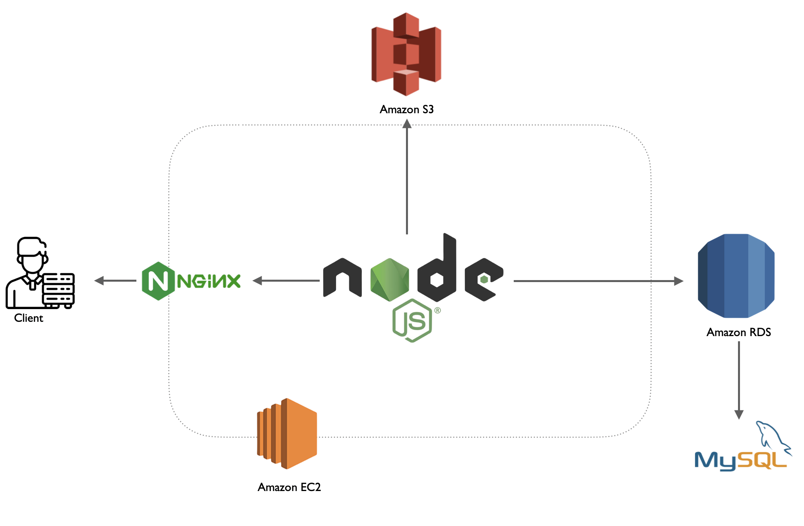
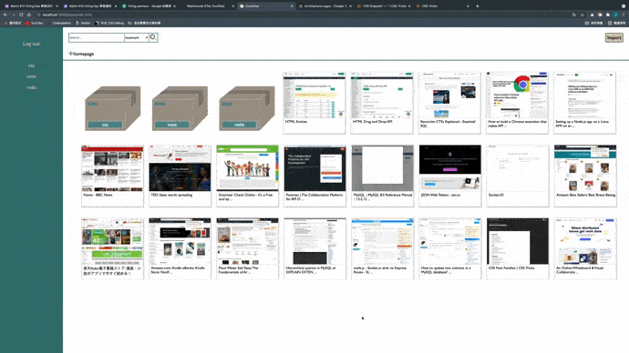

# Bookmark tool website

This website is for organizing browser bookmarks.

## Table of Content 

<ul>
  <li>Technologies</li>
  <li>Structure</li>
  <li>Database design</li>
  <li>Features</li>
</ul>

## Technologies

Back-End

<ul>
  <li>Node.js / Expresss</li>
  <li>AWS EC2</li>
</ul>

Front-End

<ul>
  <li>HTML</li>
  <li>CSS</li>
  <li>JavaScript</li>
</ul>

Web Socket

<ul>
  <li>Socket.IO</li>
</ul>

Database

<ul>
  <li>MySQL</li>
  <li>RDS</li>
  <li>Redis</li>
</ul>

Networking

<ul>
  <li>HTTP & HTTPS</li>
  <li>Domain Name System (DNS)</li>
  <li>Nginx</li>
  <li>SSL Certificate</li>
</ul>

Test

<ul>
  <li>Mocha</li>
</ul>

Others

<ul>
  <li>AWS S3</li>
</ul>

## Structure

## Database design 

## Features

<ul>
  <li>Generate bookmarks</li>
  When user imported URL, the website will call third party API to get the thumbnail and generate bookmarks.
  <li>Create Folders</li>
  User can create folders to classify their bookmarks.
  <li>Create Sticky notes</li>
  User can create sticky notes to write remarks.
  <li>Build collection boards</li>
  If there are too many bookmarks or folders, user can easily find the items by creating collection boards.
</ul>

